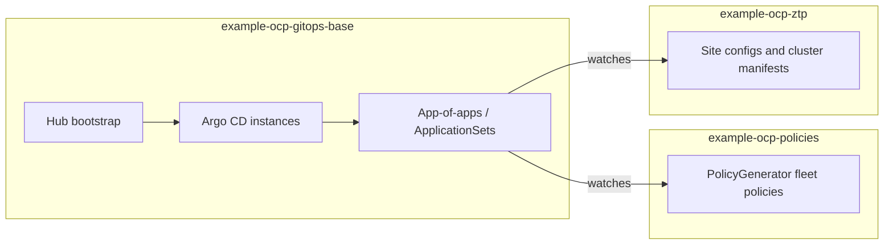

# OpenShift GitOps Reference Architecture

This organization publishes a reference implementation for managing OpenShift cluster lifecycle using Red Hat Advanced Cluster Management (ACM), Argo CD / OpenShift GitOps, and Zero Touch Provisioning (ZTP). The design is split across three coordinated Git repositories: a hub bootstrap repository that installs and wires GitOps, a fleet policies repository generated with ACM PolicyGenerator, and a ZTP repository for site configs, cluster-specific policy inputs, and supporting assets.

## Repository layout

- **example-ocp-gitops-base** bootstraps OpenShift GitOps on the hub, defines Argo CD instances, and deploys an app-of-apps pattern with ApplicationSets that point at the policies and ZTP repositories.
- **example-ocp-policies** holds ACM PolicyGenerator sources and placements, organized for fleet-wide policy rollout.
- **example-ocp-ztp** holds ZTP site configuration, cluster-specific policy inputs, extra manifests, and optional pre-flight tooling.

## Repositories

| Repository | Description |
|------------|-------------|
| [example-ocp-gitops-base](https://github.com/openshift-gitops-reference/example-ocp-gitops-base) | Hub cluster bootstrap: GitOps operator wiring, Argo CD configuration, root applications, and ApplicationSets for policies and ZTP. |
| [example-ocp-policies](https://github.com/openshift-gitops-reference/example-ocp-policies) | Fleet policies expressed with PolicyGenerator, grouped by control family for consistent governance. |
| [example-ocp-ztp](https://github.com/openshift-gitops-reference/example-ocp-ztp) | ZTP site configs, per-cluster policy material, extra manifests, and validation helpers. |

## Documentation

For component relationships, data flow, and operational boundaries, see the architecture guide in the bootstrap repository: [docs/architecture.md](https://github.com/openshift-gitops-reference/example-ocp-gitops-base/blob/main/docs/architecture.md).

## Getting started

Clone [example-ocp-gitops-base](https://github.com/openshift-gitops-reference/example-ocp-gitops-base) and follow its README for prerequisites, directory layout, and adaptation steps. That repository is the intended entry point for standing up the reference pattern on a management hub.
