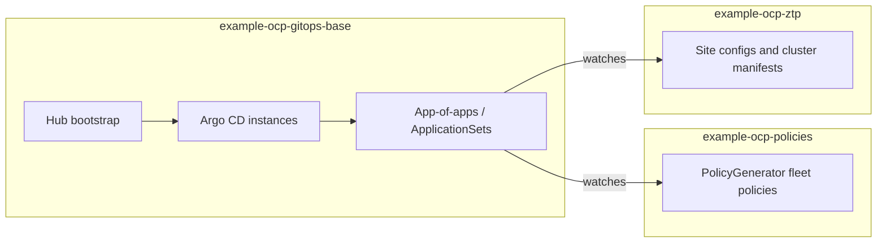

# OpenShift GitOps Reference Architecture

This organization publishes a reference implementation for managing OpenShift cluster lifecycle using Red Hat Advanced Cluster Management (ACM), Argo CD / OpenShift GitOps, and Zero Touch Provisioning (ZTP). The design is split across three coordinated Git repositories: a hub bootstrap repository that installs and wires GitOps, a fleet policies repository generated with ACM PolicyGenerator, and a ZTP repository for site configs, cluster-specific policy inputs, and supporting assets.

## Repository layout

### Why three repositories?

This architecture intentionally splits configuration across three repositories rather than using a single monorepo. This is driven by security, access control, and operational stability:

- **The Git RBAC Problem:** Git permissions apply to the *entire repository*. You cannot securely restrict write access to specific folders.
- **Protecting the Root of Trust:** `example-ocp-gitops-base` controls the Argo CD instances, root App-of-Apps, and cluster-wide RBAC. Anyone with write access here effectively has fleet-wide admin rights. It must be isolated and locked down to the **Platform Team**.
- **Delegated Access by Team:** Separate `policies` and `ztp` repos allow specific teams to safely merge updates without risking the core GitOps wiring:
  - **Platform Team** manages the core GitOps base and policies.
  - **Engineering Teams** can read and submit PRs for policies (e.g., Operator lifecycles or configuration rollouts).
  - **Network and Data Centre Teams** can read and submit PRs for ZTP (e.g., updating a site's IP address, NNCPs, routes) without needing platform-level access.
- **Separating Code vs. Config:** A monorepo forces you to mix structural templates (platform "code") with day-to-day cluster values (site "config"). Splitting them prevents tangled Git histories and noisy PRs.

- **example-ocp-gitops-base** bootstraps OpenShift GitOps on the hub, defines Argo CD instances, and deploys an app-of-apps pattern with ApplicationSets that point at the policies and ZTP repositories.
- **example-ocp-policies** holds ACM PolicyGenerator sources and placements, organized for fleet-wide policy rollout.
- **example-ocp-ztp** holds ZTP site configuration, cluster-specific policy inputs, extra manifests, and optional pre-flight tooling.

## Repositories

| Repository | Description |
|------------|-------------|
| [example-ocp-gitops-base](https://github.com/dusty-seahorse/example-ocp-gitops-base) | Hub cluster bootstrap: GitOps operator wiring, Argo CD configuration, root applications, and ApplicationSets for policies and ZTP. |
| [example-ocp-policies](https://github.com/dusty-seahorse/example-ocp-policies) | Fleet policies expressed with PolicyGenerator, grouped by control family for consistent governance. |
| [example-ocp-ztp](https://github.com/dusty-seahorse/example-ocp-ztp) | ZTP site configs, per-cluster policy material, extra manifests, and validation helpers. |

## Documentation

For component relationships, data flow, and operational boundaries, see the architecture guide in the bootstrap repository: [docs/architecture.md](https://github.com/dusty-seahorse/example-ocp-gitops-base/blob/main/docs/architecture.md).

## Getting started

Clone [example-ocp-gitops-base](https://github.com/dusty-seahorse/example-ocp-gitops-base) and follow its README for prerequisites, directory layout, and adaptation steps. That repository is the intended entry point for standing up the reference pattern on a management hub.
